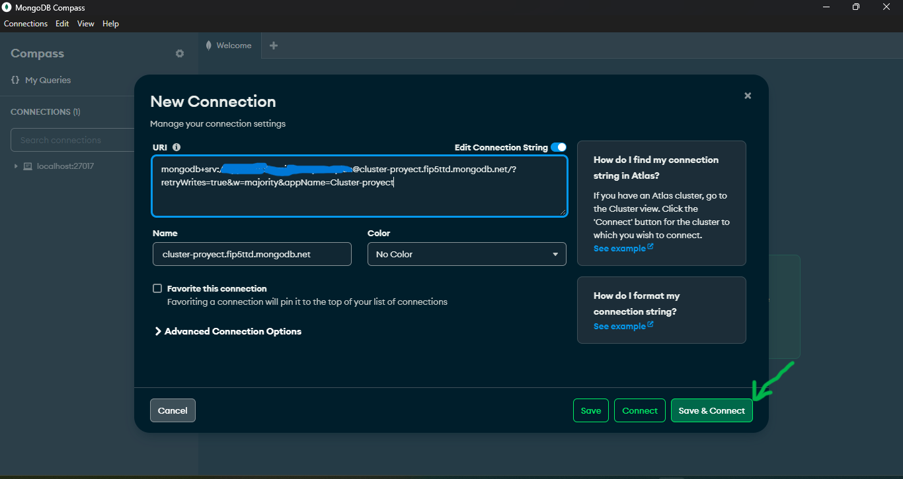
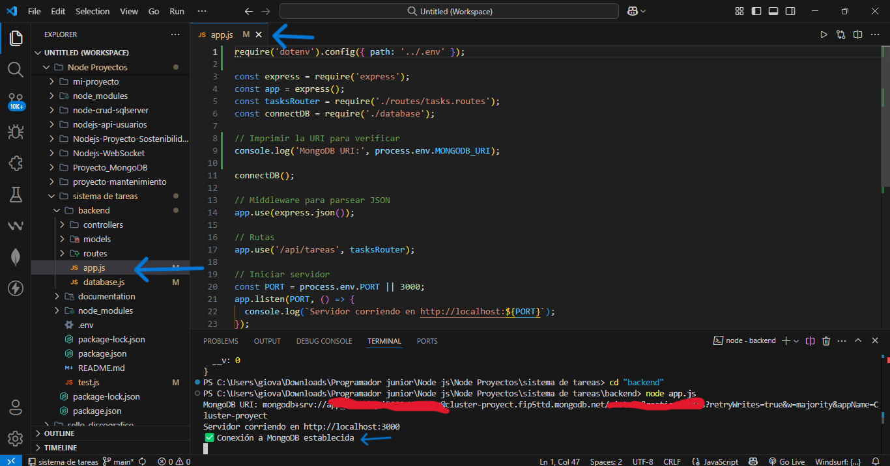

# Documentación del Proyecto

## Paso 1: Configurar MongoDB Atlas
- **Descripción**: Crea una cuenta en MongoDB Atlas, configura el acceso a la base de datos y obtén la URI de conexión.
- **Capturas de pantalla**:
  - 
  - 
  - 
  - 

## Paso 2: Instalar y Configurar MongoDB Compass
- **Descripción**: Descarga e instala MongoDB Compass y conéctate a MongoDB Atlas.
- **Capturas de pantalla**:
  - 
  - 

## Paso 3: Configurar el Proyecto en VS Code
- **Descripción**: Crea un nuevo proyecto en VS Code e instala las dependencias necesarias.
- **Capturas de pantalla**:
  - 

## Paso 4: Configurar la Conexión a MongoDB
- **Descripción**: Crea el archivo `.env` y el archivo `database.js` para configurar la conexión a MongoDB.
- **Capturas de pantalla**:
  - 
  - 

## Paso 5: Definir el Modelo de Tarea
- **Descripción**: Crea el archivo `task.model.js` para definir el modelo de tarea.
- **Capturas de pantalla**:
  - 

## Paso 6: Inicializar el Repositorio en GitHub
- **Descripción**: Crea un nuevo repositorio en GitHub y configura Git en tu proyecto.
- **Comandos Git**: git init
                    git add .
                    git commit -m "Initial commit: Database setup and task model"
                    git branch -M main
                    git remote add origin URL_DEL_REPOSITORIO#cambiar esto con lo del repo
                    git push -u origin main
- **Capturas de pantalla**:
  - 
  - 

## Paso 7: Probar la Conexión y el Modelo
- **Descripción**: Crea un archivo `test.js` y ejecútalo para probar la conexión y el modelo.
- **Capturas de pantalla**:
  - 
  - 

## Paso 8: Implementar el Endpoint GET `/tareas`
- **Descripción**: Implementa el endpoint para obtener todas las tareas de la base de datos.
- **Capturas de pantalla**:
  - 
  - 
  - 
  - 
