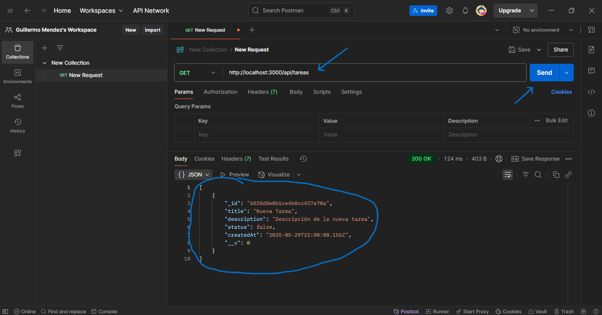
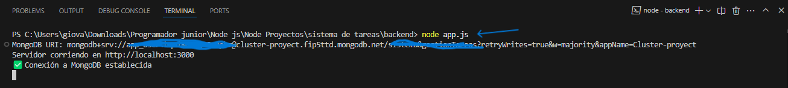

# Documentación del Proyecto

## Paso 1: Configurar MongoDB Atlas
- **Descripción**: Crea una cuenta en MongoDB Atlas, configura el acceso a la base de datos y obtén la URI de conexión.
- **Capturas de pantalla**:
  - 
  - 
  - 
  - 

## Paso 2: Instalar y Configurar MongoDB Compass
- **Descripción**: Descarga e instala MongoDB Compass y conéctate a MongoDB Atlas.
- **Capturas de pantalla**:
  - 
  - 

## Paso 3: Configurar el Proyecto en VS Code
- **Descripción**: Crea un nuevo proyecto en VS Code e instala las dependencias necesarias.
- **Capturas de pantalla**:
  - 

## Paso 4: Configurar la Conexión a MongoDB
- **Descripción**: Crea el archivo `.env` y el archivo `database.js` para configurar la conexión a MongoDB.
- **Capturas de pantalla**:
  - 
  - 

## Paso 5: Definir el Modelo de Tarea
- **Descripción**: Crea el archivo `task.model.js` para definir el modelo de tarea.
- **Capturas de pantalla**:
  - 

## Paso 6: Inicializar el Repositorio en GitHub
- **Descripción**: Crea un nuevo repositorio en GitHub y configura Git en tu proyecto.
- **Comandos Git**: git init
                    git add .
                    git commit -m "Initial commit: Database setup and task model"
                    git branch -M main
                    git remote add origin URL_DEL_REPOSITORIO#cambiar esto con lo del repo
                    git push -u origin main
- **Capturas de pantalla**:
  - 
  - 

## Paso 7: Probar la Conexión y el Modelo
- **Descripción**: Crea un archivo `test.js` y ejecútalo para probar la conexión y el modelo.
- **Capturas de pantalla**:
  - 
  - 

## Paso 8: Implementar el Endpoint GET `/tareas`
- **Descripción**: Implementa el endpoint para obtener todas las tareas de la base de datos.
- **Capturas de pantalla**:
  - 
  - 
  - 
  - 

## Paso 9: Implementar el Endpoint POST `/tareas`

- **Descripción**: Implementa el endpoint POST `/tareas` para crear nuevas tareas en la base de datos.
- **Controlador**: Se actualizó el archivo `tasks.controller.js` para incluir la función `createTask`, que valida los datos de entrada y guarda una nueva tarea en la base de datos.
  - **Capturas de pantalla**:
    - 
- **Rutas**: Se modificó el archivo `tasks.routes.js` para incluir el nuevo endpoint POST `/tareas`.
  - **Capturas de pantalla**:
    - 
- **Middleware**: Se aseguró que `app.js` tenga el middleware `express.json()` para parsear el cuerpo de las solicitudes.
  - **Capturas de pantalla**:
    - 
- **Pruebas con Postman**: Se realizó una solicitud POST a `http://localhost:3000/api/tareas` para verificar que el endpoint funciona correctamente.
  - **Capturas de pantalla**:
    - 

## Paso 10: Implementar el Endpoint PUT `/tareas/:id`

- **Descripción**: Implementa el endpoint PUT `/tareas/:id` para actualizar tareas existentes en la base de datos.
- **Controlador**: Se actualizó el archivo `tasks.controller.js` para incluir la función `updateTask`, que busca una tarea por su ID, actualiza los campos proporcionados y guarda los cambios en la base de datos.
  - **Capturas de pantalla**:
    - 
- **Rutas**: Se modificó el archivo `tasks.routes.js` para incluir el nuevo endpoint PUT `/tareas/:id`.
  - **Capturas de pantalla**:
    - 
- **Ejecutar servidor**: Se ejecuto `app.js` para que se ejecutara el servidor.
  - **Capturas de pantalla**:
    - 
- **Pruebas con Postman**: Se realizó una solicitud PUT a `http://localhost:3000/api/tareas/ID_DE_LA_TAREA` para verificar que el endpoint funciona correctamente.
  - **Capturas de pantalla**:
    - 

## Paso 11: Implementar el Endpoint DELETE `/tareas/:id`

- **Descripción**: Implementa el endpoint DELETE `/tareas/:id` para eliminar tareas existentes de la base de datos.
- **Controlador**: Se actualizó el archivo `tasks.controller.js` para incluir la función `deleteTask`, que busca y elimina una tarea por su ID.
  - **Capturas de pantalla**:
    - 
- **Rutas**: Se modificó el archivo `tasks.routes.js` para incluir el nuevo endpoint DELETE `/tareas/:id`.
  - **Capturas de pantalla**:
    - 
- **Pruebas con Postman**: Se realizó una solicitud DELETE a `http://localhost:3000/api/tareas/ID_DE_LA_TAREA` para verificar que el endpoint funciona correctamente.
  - **Capturas de pantalla**:
    - 

## Paso 12: Implementar el Endpoint GET `/tareas/:id`

- **Descripción**: Implementa el endpoint GET `/tareas/:id` para obtener detalles específicos de una tarea existente en la base de datos.
- **Controlador**: Se actualizó el archivo `tasks.controller.js` para incluir la función `getTaskById`, que busca una tarea por su ID y devuelve sus detalles.
  - **Capturas de pantalla**:
    - 
- **Rutas**: Se modificó el archivo `tasks.routes.js` para incluir el nuevo endpoint GET `/tareas/:id`.
  - **Capturas de pantalla**:
    - 
- **Pruebas con Postman**: Se realizó una solicitud GET a `http://localhost:3000/api/tareas/ID_DE_LA_TAREA` para verificar que el endpoint funciona correctamente.
  - **Capturas de pantalla**:
    - 